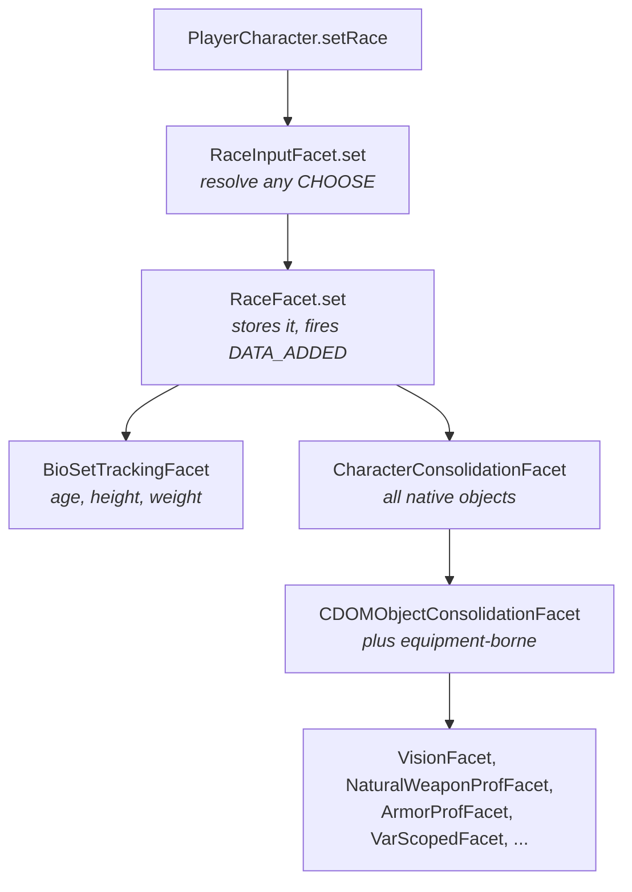

# The character model

Loaded game data lives in [`CDOMObject` instances](cdom-model.md). A character is a
different thing: a set of choices, plus everything those choices imply. PCGen holds it
in 234 facet classes, and almost none of it in the character object.

All paths are relative to the PCGen repository root, at commit
[`d262f8b4`](https://github.com/PCGen/pcgen/tree/d262f8b44952860ff857132035fb32d8d11361fa).

## PlayerCharacter holds a number

`PlayerCharacter.java` is 9,910 lines, which suggests it holds the character. It does
not. It holds an identifier and about 107 facet references:

```java
private final RaceFacet raceFacet = FacetLibrary.getFacet(RaceFacet.class);
```

*Source: [`PlayerCharacter.java`](https://github.com/PCGen/pcgen/blob/d262f8b44952860ff857132035fb32d8d11361fa/code/src/java/pcgen/core/PlayerCharacter.java)*

Its methods are mostly thin. `setRace` calls a facet and then recalculates bonuses.

The identifier is a `CharID`:

```java
public final class CharID implements TypeSafeConstant, PCGenIdentifier
```

*Source: [`CharID.java`](https://github.com/PCGen/pcgen/blob/d262f8b44952860ff857132035fb32d8d11361fa/code/src/java/pcgen/cdom/enumeration/CharID.java)*

## Where the state actually is

One static map, at the root of the facet hierarchy:

```java
private static final DoubleKeyMap<PCGenIdentifier, Class<?>, Object> CACHE
```

*Source: [`AbstractStorageFacet.java`](https://github.com/PCGen/pcgen/blob/d262f8b44952860ff857132035fb32d8d11361fa/code/src/java/pcgen/cdom/facet/base/AbstractStorageFacet.java)*

Keyed by character and by facet class. So a facet is a singleton holding no fields of
its own. Asking it for a value means passing the `CharID` of the character you mean:

```java
raceFacet.get(id)
```

Two characters open at once share every facet object and keep separate slots in that
map.

`copyContents` is abstract on the storage base, so each facet must state how its data
is copied. Cloning a character otherwise shares mutable structures between the copy and
the original.

## The shapes of facet

Fourteen base classes in `pcgen/cdom/facet/base/`. Four cover most cases.

| Base | Holds | Example |
|---|---|---|
| `AbstractItemFacet` | one value or none | `RaceFacet` |
| `AbstractListFacet` | several values, no source tracking | `KitFacet`, `StatFacet` |
| `AbstractSourcedListFacet` | several values, remembering what granted each | `LanguageFacet` |
| `AbstractQualifiedListFacet` | the same, for things gated by prerequisites | `AutoLanguageFacet`, `SpellsFacet` |

Ability facets are not in that fourth row, which is the obvious guess and the wrong one.
They extend `AbstractCNASEnforcingFacet` instead.

Source tracking is the interesting one. If a race and a template both grant the same
language, a sourced list holds one entry with two sources. It reports the addition once,
and reports removal only when the last source goes away.

That is what stops a character losing a language they still have another reason to know.

### The other ten

The fourteen form a tree, and the split that matters is one level up.
`AbstractStorageFacet` stores. `AbstractDataFacet` extends it and adds the event
broadcast. **A facet that does not extend `AbstractDataFacet` cannot be listened to.**

| Base | Extends | Holds |
|---|---|---|
| `AbstractStorageFacet` | — | the root. Cache access, and nothing else |
| `AbstractDataFacet` | storage | the root of everything that fires events |
| `AbstractSingleSourceListFacet` | data | several values, each with exactly one source |
| `AbstractItemConvertingFacet` | data | several values, converted on the way in |
| `AbstractCNASEnforcingFacet` | data | ability selections, with their own ordering rules |
| `AbstractScopeFacet` | storage | values keyed by a scope as well as an id |
| `AbstractAssociationFacet` | scope | one association per source |
| `AbstractSubScopeFacet` | storage | the same, two scopes deep |
| `AbstractSubAssociationFacet` | scope | one association, two scopes deep |
| `AbstractScopeFacetConsolidator` | list | flattens a scoped facet into a plain list |

The difference between `AbstractSourcedListFacet` and `AbstractSingleSourceListFacet` is
the one to get right. Both track where a value came from. The single-source version
assumes one owner and replaces it. The sourced version keeps a set, and that is what
makes the removal behaviour above work.

## Adding a facet

!!! note "Check that a facet is what you want"
    A facet is right for state the engine **derives** — computed from the race, the
    class, the equipment, and rebuilt when those change.

    It is the wrong tool for a value the **user** sets and the save file has to carry.
    That is a code control channel, and money is the worked example in
    [changing behaviour](changing-behaviour.md#4-new-character-state-has-to-survive-the-save).
    A facet holding user input will not reach the `.pcg` file.

Worked example. A facet that stores one derived value and recomputes it when the race
changes.

**1. Pick the base by how the value is held**, not by what it means. One or none, a list,
a list with sources, a list gated by prerequisites.

```java
public class SampleTerrainFacet extends AbstractItemFacet<CharID, String>
        implements DataFacetChangeListener<CharID, Race>
```

**2. Do not implement `copyContents`.** It is abstract on `AbstractStorageFacet`, but all
four bases above already implement it. You write one only when you extend
`AbstractStorageFacet` directly. The contract is a deep copy. After it returns, changing
one character must not touch the other.

**3. Take dependencies as plain setters.** No annotation. Spring injects them.

```java
public void setRaceFacet(RaceFacet raceFacet)
{
    this.raceFacet = raceFacet;
}
```

**4. Wire yourself in `init()`.** This is the method Spring calls, and it is where the
listener registration goes.

```java
public void init()
{
    raceFacet.addDataFacetChangeListener(this);
    OutputDB.register("sampleterrain", this);
}
```

`OutputDB.register` is optional and is how a facet becomes a top-level key in a
[character sheet](../outputsheets/writing-a-sheet.md). Its overloads take an `ItemFacet`,
a `SetFacet` or a `CControl`. That is an interface test rather than a base-class one, so
plenty of `AbstractListFacet` subclasses register — `KitFacet`, `CheckFacet`, `StatFacet`
and `CompanionModFacet` all implement `SetFacet`.

**5. Write the two event methods.** They are the work. Everything above is wiring.

```java
@Override
public void dataAdded(DataFacetChangeEvent<CharID, Race> dfce)
{
    set(dfce.getCharID(), computeFrom(dfce.getCDOMObject()));
}

@Override
public void dataRemoved(DataFacetChangeEvent<CharID, Race> dfce)
{
    remove(dfce.getCharID());
}
```

**6. Declare the bean** in `code/src/resources/applicationContext.xml`, under the
alphabetical comment for its letter:

```xml
<bean id="sampleTerrainFacet" class="pcgen.cdom.facet.analysis.SampleTerrainFacet">
    <property name="raceFacet" ref="raceFacet"/>
</bean>
```

The file's root element sets `default-init-method="init"`. That single attribute is what
calls step 4. Without a bean, `FacetLibrary` falls back to reflection and logs an error.

**7. Write the test** against the matching support base, such as
`code/src/test/pcgen/cdom/testsupport/AbstractItemFacetTest.java`.

### `FacetInitialization` is the older path

The long method described above still exists and still runs, but it is now the minority.
Measured at the pinned commit:

| Wiring | Facets |
|---|---|
| own `init()`, called by Spring | 109 |
| `addDataFacetChangeListener` calls in `FacetInitialization` | 42 |

Read `FacetInitialization` to see the dependency graph. Write new wiring in `init()`.

*Source: [`AgeSetFacet.java`](https://github.com/PCGen/pcgen/blob/d262f8b44952860ff857132035fb32d8d11361fa/code/src/java/pcgen/cdom/facet/analysis/AgeSetFacet.java)*

## Getting a facet

```java
FacetLibrary.getFacet(RaceFacet.class)
```

The library looks in its own map first, then asks Spring for a bean. Only if Spring has
no bean does it construct the class by reflection, and it logs an error when it does.
Spring wiring is the intended path.

*Source: [`FacetLibrary.java`](https://github.com/PCGen/pcgen/blob/d262f8b44952860ff857132035fb32d8d11361fa/code/src/java/pcgen/cdom/facet/FacetLibrary.java)*

## How facets are wired together

Facets react to each other through events. The wiring itself is not annotations or
configuration — it is a long method that runs once at startup:

```java
raceFacet.addDataFacetChangeListener(bioSetTrackingFacet);
raceFacet.addDataFacetChangeListener(charObjectFacet);
```

*Source: [`FacetInitialization.java`](https://github.com/PCGen/pcgen/blob/d262f8b44952860ff857132035fb32d8d11361fa/code/src/java/pcgen/cdom/facet/FacetInitialization.java)*

Forty-two listener registrations are made there by hand. Reading that method is the
fastest way to see the dependency graph. It is no longer where most wiring lives. See
[adding a facet](#adding-a-facet).

### The order events arrive in

Listeners are held in a `TreeMap` keyed by an integer priority, so priorities fire in
ascending order. Within one priority, listeners fire in the order they registered — the
list is built by prepending and read back to front.

Almost everything uses the default priority of zero. Four places do not, and they are
the ordering rules of the character model stated in code:

| Priority | Facet | Why it waits |
|---|---|---|
| 1 | `NaturalEquipSetFacet` | after natural weapons exist |
| 1000 | `BonusActiviationFacet` | after the granting facets have run |
| 2000 | `MovementResultFacet` | after bonuses are active |
| 5000 | `CalcBonusFacet` | last, once everything else settled |

A new listener at the default priority runs before all four. If it depends on bonuses
being active, it needs a number above 1000.

*Source: [`AbstractDataFacet.java`](https://github.com/PCGen/pcgen/blob/d262f8b44952860ff857132035fb32d8d11361fa/code/src/java/pcgen/cdom/facet/base/AbstractDataFacet.java)*

The event contract is two methods and two constants:

```java
public interface DataFacetChangeListener<IDT, T>
{
    void dataAdded(DataFacetChangeEvent<IDT, T> dfce);
    void dataRemoved(DataFacetChangeEvent<IDT, T> dfce);
}
```

*Source: [`DataFacetChangeListener.java`](https://github.com/PCGen/pcgen/blob/d262f8b44952860ff857132035fb32d8d11361fa/code/src/java/pcgen/cdom/facet/event/DataFacetChangeListener.java)*

## A worked trace: setting a race



1. `PlayerCharacter.setRace` calls `raceInputFacet.set(id, race)`.
2. `RaceInputFacet` resolves a `CHOOSE:` on the race if there is one, then calls
   `RaceFacet.set`.
3. `RaceFacet` stores the value and fires `DATA_ADDED`.
4. `BioSetTrackingFacet` updates age, height and weight for the new race.
5. `CharacterConsolidationFacet` folds the race into one list of every game object the
   character has natively, and fires its own event.
6. `CDOMObjectConsolidationFacet` merges that list with objects coming from equipment,
   and fires again.
7. Everything derived listens to that last one: vision, natural weapons, armour
   proficiencies, special abilities, variable scopes.

`PlayerCharacter` orchestrates none of steps 4 to 7. It calls one facet and then
recalculates bonuses.

The two consolidation facets carry the closest thing to a stated reason for the
design. Gathering every object into one place lets a downstream facet listen to a
single source. Without it, each would need to know every kind of thing that grants
something.

*Source: [`CDOMObjectConsolidationFacet.java`](https://github.com/PCGen/pcgen/blob/d262f8b44952860ff857132035fb32d8d11361fa/code/src/java/pcgen/cdom/facet/CDOMObjectConsolidationFacet.java)*

There is no design document, no `package-info.java` and no note in `AGENTS.md`
explaining the architecture as a whole. The class comments are what exists.

## CharacterDisplay

`CharacterDisplay` is a read-only view over the same facet cache. It holds a `CharID`,
reads 71 facets, and exposes queries with no setters.

*Source: [`CharacterDisplay.java`](https://github.com/PCGen/pcgen/blob/d262f8b44952860ff857132035fb32d8d11361fa/code/src/java/pcgen/core/display/CharacterDisplay.java)*

Output tokens, term evaluators and prerequisite tests go through
`PlayerCharacter.getDisplay()` rather than the character itself. Anything that only
reads should do the same.

## What bites when you add or change a facet

### A facet missing from Spring works, until someone copies a character

`PlayerCharacter.clone()` copies state by iterating `SpringHelper.getStorageBeans()`,
which asks the bean factory for every `AbstractStorageFacet`. A facet not listed in
`code/src/resources/applicationContext.xml` still runs, because `FacetLibrary` falls back
to reflection. It is absent from that collection, so its state is **empty on every
clone**, and nothing reports it.

That is the practical reason the reflection fallback logs an error rather than passing
quietly.

### Copying fires no events

`copyContents` writes straight into the cache on both the item and list bases. Neither
calls `fireDataFacetChangeEvent`. A clone is built by bulk copy rather than by replaying
the adds. So a facet that recomputes only on an event is never rebuilt on the copy.

### A list copy is shallow

`AbstractListFacet.getCopyForNewOwner` hands over the same contents, so the original and
the clone share mutable objects. `PlayerCharacter.clone` works around this by hand
afterwards, wiping and re-cloning equipment, level information and spell books.

A new list facet holding mutable objects needs that override, or an edit to the copy
changes the original.

### Nothing evicts a character, so a forgotten listener leaks it

The cache is one static `DoubleKeyMap` over a `WeakHashMap` keyed by `CharID`, and
`removeCache` is only ever called per facet. Closing a character unregisters four
listeners and never clears the cache.

Facets are process-wide singletons, so a listener you register and forget holds the
`CharID`, which holds the whole character's state. Stale interface code can still read
it.

### Set the input facet, not the model facet

`RaceInputFacet.set` runs the chooser and, on a change, removes the previous race's entry
from `RaceSelectionFacet`. Calling `RaceFacet.set` directly skips both, and the old
selection stays attached. The cleanup is also gated on `isAllowInteraction`, so it does
not run during an import.

The `cdom/facet/input/` package exists for this reason. Prefer it.

*Source: [`PlayerCharacter.java`](https://github.com/PCGen/pcgen/blob/d262f8b44952860ff857132035fb32d8d11361fa/code/src/java/pcgen/core/PlayerCharacter.java), [`SpringHelper.java`](https://github.com/PCGen/pcgen/blob/d262f8b44952860ff857132035fb32d8d11361fa/code/src/java/pcgen/cdom/helper/SpringHelper.java), [`AbstractStorageFacet.java`](https://github.com/PCGen/pcgen/blob/d262f8b44952860ff857132035fb32d8d11361fa/code/src/java/pcgen/cdom/facet/base/AbstractStorageFacet.java), [`AbstractListFacet.java`](https://github.com/PCGen/pcgen/blob/d262f8b44952860ff857132035fb32d8d11361fa/code/src/java/pcgen/cdom/facet/base/AbstractListFacet.java), [`RaceInputFacet.java`](https://github.com/PCGen/pcgen/blob/d262f8b44952860ff857132035fb32d8d11361fa/code/src/java/pcgen/cdom/facet/input/RaceInputFacet.java)*

## What this means when you change something

**A value is wrong on the sheet.** Find the facet that owns it, not the place the tag
was parsed. The tag stored data on a `CDOMObject` long before this point.

**Something is not appearing after a choice.** Check the listener wiring in
`FacetInitialization`. A facet with no registered listener silently does nothing.

**A new derived value needs adding.** The pattern is a new facet listening to
`CDOMObjectConsolidationFacet`, registered in `FacetInitialization` and fetched through
`FacetLibrary`.

## Keeping the caches honest

A facet is not the only place character state lives. `PlayerCharacter` also caches
derived numbers against a serial, and a mutation that skips `setDirty(true)` leaves those
caches serving old values. See
[changing behaviour](changing-behaviour.md#1-a-cached-number-goes-stale-unless-the-serial-moves).

## Related

- [The object model](cdom-model.md) — what facets store
- [The interface layer](ui-layer.md) — how the window reads a character
- [Output and saving](output-and-saving.md) — what reads through `CharacterDisplay`
- [Load pipeline](load-pipeline.md) — where the objects came from
