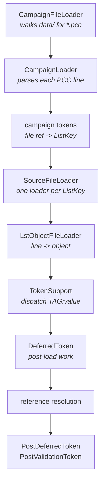

# Load pipeline

The path from a `.pcc` on disk to a populated object graph, with the class at each
step. For the version without Java in it, see
[how loading works](../start/how-loading-works.md).

All paths are relative to the PCGen repository root, at commit
[`d262f8b4`](https://github.com/PCGen/pcgen/tree/d262f8b44952860ff857132035fb32d8d11361fa).

## Overview



## 1. Discovery

[`CampaignFileLoader`](https://github.com/PCGen/pcgen/blob/d262f8b44952860ff857132035fb32d8d11361fa/code/src/java/pcgen/persistence/CampaignFileLoader.java)
is a `PCGenTask` that walks the configured data directories for `*.pcc`. Every file it
finds is parsed into a `Campaign` and becomes a source-selection entry.

Discovery is separate from loading. A campaign appears in the list because its `.pcc`
parsed, not because its data is valid.

## 2. Parsing the PCC

[`CampaignLoader`](https://github.com/PCGen/pcgen/blob/d262f8b44952860ff857132035fb32d8d11361fa/code/src/java/pcgen/persistence/lst/CampaignLoader.java)
extends `LstLineFileLoader` and handles one PCC line at a time. Each line is a tag,
dispatched to a class in
[`plugin/lsttokens/campaign/`](https://github.com/PCGen/pcgen/tree/d262f8b44952860ff857132035fb32d8d11361fa/code/src/java/plugin/lsttokens/campaign)
— 57 of them.

File-reference tags mostly extend `AbstractBasicCampaignToken`, which turns the value
into a `CampaignSourceEntry` and files it on the `Campaign` under a `ListKey`. The
whole of the PCC `SKILL:` tag is that mapping:

```java
public String getTokenName() { return "SKILL"; }
protected ListKey<CampaignSourceEntry> getListKey() { return ListKey.FILE_SKILL; }
```

*Source: [`campaign/SkillToken.java`](https://github.com/PCGen/pcgen/blob/d262f8b44952860ff857132035fb32d8d11361fa/code/src/java/plugin/lsttokens/campaign/SkillToken.java)*

So `SKILL:my_skills.lst` means "add this path to `FILE_SKILL`". `RACE:` maps to
`FILE_RACE`, `CLASS:` to `FILE_CLASS`, and so on. The PCC is a routing table.

`CampaignSourceEntry` resolves the path, including the `*/` prefix meaning
data-root-relative, and the optional `|PRExxx` suffix that conditionally includes a
file.

`PCC:` pulls in another campaign; `CampaignLoader.initRecursivePccFiles` flattens
sub-campaign file lists into the parent.

## 3. Dispatching to loaders

[`SourceFileLoader`](https://github.com/PCGen/pcgen/blob/d262f8b44952860ff857132035fb32d8d11361fa/code/src/java/pcgen/persistence/SourceFileLoader.java)
collects the file lists from every selected campaign and runs one loader per `ListKey`:

| ListKey | Loader |
|---|---|
| `FILE_RACE` | `GenericLoader<>(Race.class)` |
| `FILE_SKILL` | `GenericLocalVariableLoader<>(Skill.class, "PC.SKILL")` |
| `FILE_CLASS` | `PCClassLoader()` |

Most types need no special handling, so `GenericLoader` covers them by reflection.
Classes, abilities, kits and companion mods have their own loaders.

## 4. Line to object

[`LstObjectFileLoader`](https://github.com/PCGen/pcgen/blob/d262f8b44952860ff857132035fb32d8d11361fa/code/src/java/pcgen/persistence/lst/LstObjectFileLoader.java)
reads each file and processes it a line at a time. It also implements `.MOD`, `.COPY`
and `.FORGET`, and honours the PCC's `LSTEXCLUDE`.

Reading is done by
[`LstFileLoader`](https://github.com/PCGen/pcgen/blob/d262f8b44952860ff857132035fb32d8d11361fa/code/src/java/pcgen/persistence/lst/LstFileLoader.java),
a static utility. Two constants there define the file format:

```java
public static final char LINE_COMMENT_CHAR = '#';
public static final String LINE_SEPARATOR_REGEXP = "(\r\n?|\n)";
```

Field 0 becomes the object name. Every later tab-separated field is a `TAG:value`.

## 5. Token dispatch

[`TokenSupport`](https://github.com/PCGen/pcgen/blob/d262f8b44952860ff857132035fb32d8d11361fa/code/src/java/pcgen/rules/persistence/TokenSupport.java)
resolves `(object class, tag name)` to a token and calls it. Lookup walks the target
object's class hierarchy, which is how a tag declared on `CDOMObject` works on
everything while one declared on `Skill` does not.

The token contract is small:

```java
public interface CDOMToken<T> extends LstToken
{
    ParseResult parseToken(LoadContext context, T obj, String value);
    Class<T> getTokenClass();
}
```

*Source: [`CDOMToken.java`](https://github.com/PCGen/pcgen/blob/d262f8b44952860ff857132035fb32d8d11361fa/code/src/java/pcgen/rules/persistence/token/CDOMToken.java)*

Tokens do not mutate domain objects directly. They write through `LoadContext` into an
`ObjectContext`, keyed by `ObjectKey` or `ListKey`. `unparse` reads those changes back
and regenerates the original tag string. The token unit tests assert that round-trip,
which makes them a reliable specification of accepted syntax.

Sub-tokens such as `ADD:ABILITY` and `CHOOSE:SKILL` implement `CDOMSecondaryToken` and
are keyed by parent plus name.

## 6. Post-load phases

Names cannot be resolved during loading, because the target may not exist yet. So
loading finishes first, then:

1. `DeferredToken.process` — per-token work needing the whole file set.
2. Reference resolution — every `CDOMReference` is matched to its target. Unresolved
   names are reported here.
3. `PostDeferredToken`, then `PostValidationToken`, each ordered by `getPriority()`.

This is why an error can name a file you did not edit: the dangling reference is
detected by whatever pointed at your object.

## Where tokens come from

Token classes are not registered anywhere. `plugins.gradle` jars each plugin package
separately, `PluginClassLoader` scans `*plugins.jar` at startup, and `TokenLibrary`
claims every class implementing a token interface.

Adding a tag means adding a class to `plugin/lsttokens/` and nothing else.

| Package | Classes | Provides |
|---|---|---|
| `plugin/lsttokens` | 653 | data and game mode tags |
| `plugin/pretokens` | 215 | `PRExxx`, split into parser, test and writer |
| `plugin/bonustokens` | 55 | `BONUS:` subtypes |
| `plugin/primitive` | 23 | chooser primitives |
| `plugin/qualifier` | 22 | chooser qualifiers |
| `plugin/modifier` | 15 | formula system operators |

Counts read from the source at the pinned commit.

## Verifying a dataset loads

PCGen has no "validate this PCC" command. The headless CLI (`--exportsheet` with
`--character`) only exports characters.

What does work is the test harness PCGen's own CI runs:

```sh
./gradlew datatest
```

That runs `DataLoadTest`, which loads datasets through `SourceFileLoader` and asserts
**zero errors and zero warnings**.

To point it at your own data, put a `config.ini` at the repository root:

```ini
pccFilesPath=/absolute/path/to/your/data
```

!!! warning "SHOWINMENU is required"
    `DataLoadTest` selects campaigns that are shown in the menu or belong to a game
    mode's default set. A `.pcc` without `SHOWINMENU:YES` is skipped silently — the
    test passes without testing anything.

*Source: [`DataLoadTest.java`](https://github.com/PCGen/pcgen/blob/d262f8b44952860ff857132035fb32d8d11361fa/code/src/slowtest/pcgen/persistence/lst/DataLoadTest.java)*

## Related

- [How loading works](../start/how-loading-works.md) — the same path without Java
- [The token system](token-system.md) — what happens at each tag
- [Testing](testing.md) — running the data load test yourself
