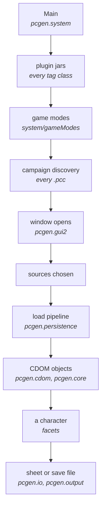

# How PCGen fits together

The whole program on one page: what the pieces are, which way they depend on each
other, and where the real boundaries sit. Read this before the pages that go deep.

For where files live rather than how code is arranged, see
[repository layout](architecture.md).

All paths are relative to the PCGen repository root, at commit
[`d262f8b4`](https://github.com/PCGen/pcgen/tree/d262f8b44952860ff857132035fb32d8d11361fa).

## The shape of a run



Every box has its own page. This one covers the arrows.

## Three Gradle projects

| Project | Provides |
|---|---|
| `PCGen-base` | value-semantic utilities: formats, collections, maths |
| `PCGen-Formula` | the expression parser and solver |
| `pcgen` | everything else |

Dependencies run one way and only one way:

```
PCGen-base  <--  PCGen-Formula  <--  pcgen
```

Neither library knows PCGen exists. `PCGen-Formula` declares its dependency on
`PCGen-base` and nothing more.

*Source: [`PCGen-Formula/build.gradle`](https://github.com/PCGen/pcgen/blob/d262f8b44952860ff857132035fb32d8d11361fa/PCGen-Formula/build.gradle)*

`PCGen-Formula` is largely generated. Its parser comes from a JavaCC grammar at build
time, so most of `pcgen.base.formula.parse` has no hand-written source. See
[the formula system](formula-system.md).

## Java modules, and the rule they impose

`code/src/java/module-info.java` declares one module, `pcgen`. It requires the two
libraries as **modules**, not merely as jars on the classpath.

*Source: [`module-info.java`](https://github.com/PCGen/pcgen/blob/d262f8b44952860ff857132035fb32d8d11361fa/code/src/java/module-info.java)*

That has a consequence contributors run into:

!!! warning "No split packages"
    A class in the `pcgen` module may not sit in a package that also exists in
    `PCGen-base` or `PCGen-Formula`. Java forbids one package spanning two modules.

This is why `pcgen.util` and `pcgen.format` are named as they are. Their natural names
would have been `pcgen.base.util` and `pcgen.base.format`, which the library already
owns. There is no `pcgen.base` package anywhere in the main source tree.

The module opens a long list of packages for reflection, mostly for Spring and for
JavaFX loading its FXML. It exports only eight.

## Four top-level packages

`code/src/java/` holds four package trees, and two of them are not what their size
suggests.

| Package | Is | State |
|---|---|---|
| `pcgen` | the program | active |
| `plugin` | every tag class, jarred separately | active |
| `gmgen` | four dice classes | vestigial |
| `translation` | one helper for translators | auxiliary |

`gmgen` was once Game Master Genie, a companion application. What survives is a dice
roller that nothing in `pcgen.*` imports. Its only caller is its own test.

`translation` holds a single class, and its own package comment says it should not ship
with the program. It is tooling for translators that happens to live beside the source.

Neither is worth reading. Both look important from a directory listing, which is why
they are named here.

## The layers inside pcgen

| Package | Job |
|---|---|
| `system` | startup, settings, configuration |
| `persistence` | reading `.pcc` and `.lst` files |
| `rules` | the load-time context tags write through |
| `cdom` | the object model, and the facets holding a character |
| `core` | game objects and the older logic around them |
| `facade` | the interface the window is meant to use |
| `gui2` | the Swing window |
| `gui3` | the JavaFX parts |
| `io` | export and save |
| `output` | the FreeMarker data model |
| `pluginmgr` | loading interactive plugins |
| `util`, `format` | helpers |

## The dependency direction, measured

Package names suggest layers. The imports do not agree.

Counted at the pinned commit, these pairs import each other in **both** directions:

| Pair | One way | The other |
|---|---|---|
| `cdom` and `core` | 288 files | 185 files |
| `cdom` and `rules` | 55 files | 59 files |
| `rules` and `persistence` | 16 files | 36 files |
| `core` and `io` | 8 files | 41 files |
| `gui2` and `gui3` | 50 files | 15 files |
| `system` and `gui2` | 4 files | 106 files |

Two edges are genuinely one-directional:

- `pluginmgr` depends on `core`, not the reverse. It imports nothing from `cdom`.
- `gui2` and `gui3` depend on `facade`, and `facade` barely depends on them.

The one that surprises people: **`core` imports the Swing interface.** Eight files do,
including `Globals`. Domain logic reaching into the window is the reverse of every
diagram anyone would draw.

Treat the package names as history, not as architecture. When tracing a change, follow
imports rather than assuming a layer cannot call upward.

## The seams

Four places are meant to be boundaries. Two hold.

| Seam | Holds? |
|---|---|
| Plugin jars for tags | **yes** — separate jars, discovered at startup |
| `PCGen-base` and `PCGen-Formula` | **yes** — enforced by the module system |
| The facade layer | partly — 93 of 241 `gui2` files bypass it |
| Swing versus JavaFX | no — `gui2` reaches into `gui3` more than the reverse |

The two that hold are the two a tool enforces. The two that leak are the two policed by
convention. That is the pattern worth taking away.

See [plugin loading](plugin-loading.md) and [the interface layer](ui-layer.md).

## Libraries that shape the design

| Library | Used for |
|---|---|
| Spring beans and core | wiring facets and other singletons |
| FreeMarker | the newer character sheet templates |
| Apache FOP, Saxon | producing PDF output |
| JEP | evaluating older formula expressions |
| JavaFX | the newer parts of the interface |
| argparse4j | command line parsing |

*Source: [`build.gradle`](https://github.com/PCGen/pcgen/blob/d262f8b44952860ff857132035fb32d8d11361fa/build.gradle)*

Two formula systems is not a mistake in the list. JEP evaluates the older expression
syntax while `PCGen-Formula` handles the newer one. Both are live. Almost all shipped
data runs through JEP. [The formula system](formula-system.md) covers both engines, and
[the rules engine](rules-engine.md) says which one a given tag reaches.

## Where to go next

| If you want to | Read |
|---|---|
| compile and run it | [building from source](building.md) |
| know what happens at launch | [startup sequence](startup.md) |
| follow a data file into memory | [load pipeline](load-pipeline.md) |
| understand how a tag is implemented | [the token system](token-system.md) |
| know what an object looks like in memory | [the object model](cdom-model.md) |
| know how a character is assembled | [the character model](facets.md) |
| change the window | [the interface layer](ui-layer.md) |
| change a character sheet | [character sheets and output](output-and-saving.md) |
| submit a change | [contributing](contributing.md) |

## Related

- [Repository layout](architecture.md) — where the files are
- [Startup sequence](startup.md) — the first arrow in the diagram
- [The formula system](formula-system.md) — the two subprojects
- [Contributing](contributing.md) — the split-package rule in practice
