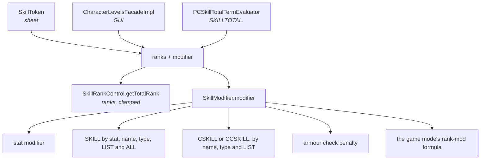

# The rules engine

How a number on the character sheet is produced. The data is loaded, the choices are
made, and something has to turn that into "your skill total is 11".

That something is not one class. It is a bonus map rebuilt from scratch on every
change, and two formula systems running side by side. Around them sits a loop that
repeats until the answer stops moving.

All paths are relative to the PCGen repository root, at commit
[`d262f8b4`](https://github.com/PCGen/pcgen/tree/d262f8b44952860ff857132035fb32d8d11361fa).

## Two formula systems, both live

| System | Evaluates | Reached from |
|---|---|---|
| JEP | the older formula strings | `DEFINE:`, and the value field of `BONUS:` |
| PCGen-Formula | the newer variable system | `MODIFY:` and `MODIFYOTHER:` |

Which one runs is decided **when the tag is parsed**, not at runtime. `DEFINE:` builds a
`JEPFormula`; `MODIFY:` builds a modifier registered with a `SolverManager`. There is no
dispatcher choosing between them later.

*Source: [`FormulaFactory.java`](https://github.com/PCGen/pcgen/blob/d262f8b44952860ff857132035fb32d8d11361fa/code/src/java/pcgen/cdom/base/FormulaFactory.java)*

Every character carries both. See [the formula system](formula-system.md) for the newer
one and [variables and formulas](../lst/concepts/variables-and-formulas.md) for the data
author's view.

## Nothing is incremental

There is no dirty flag that lets PCGen skip work. Adding a level, equipping an item,
setting a stat, or loading a character all call the same method, and it rebuilds the
whole bonus map:

```java
public void calcActiveBonuses()
```

*Source: [`PlayerCharacter.java`](https://github.com/PCGen/pcgen/blob/d262f8b44952860ff857132035fb32d8d11361fa/code/src/java/pcgen/core/PlayerCharacter.java)*

Most callers invoke it explicitly. Only race changes trigger it through a listener, and
`CalcBonusFacet` carries a comment saying the other paths were left explicit on purpose.

## The convergence loop

This is the part that surprises people. `calcActiveBonuses` does not compute once. It
computes repeatedly until the result stops changing.

The reason is written in the source, and nowhere else. One variable can carry a
prerequisite that depends on a second variable. That second value is not correct until
the map is finished, so the first pass can be wrong.

Each pass checkpoints the map, rebuilds, and compares. If it has not settled after 29
passes it logs an error, and after 31 it gives up:

```text
Active bonus loop exceeded reasonable limit of 29.
```

Data can cause that. A prerequisite that depends on a value that depends on the
prerequisite never settles, and the character ends up with whatever the last pass
produced.

If you see that line in a log, it is a data problem, not a program fault.

## The bonus pass

Inside each pass, `BonusManager.buildActiveBonusMap` runs in two stages:

1. **Static bonuses first.** Anything whose value is a plain number is applied directly.
2. **Everything else, recursively.** A bonus whose value is a formula may depend on
   another bonus. `processBonus` resolves those dependencies first, guarding against
   cycles with a set of bonuses already seen.

*Source: [`BonusManager.java`](https://github.com/PCGen/pcgen/blob/d262f8b44952860ff857132035fb32d8d11361fa/code/src/java/pcgen/core/BonusManager.java)*

The result is a map keyed by strings that encode the whole target:

```text
COMBAT.AC:Armor
COMBAT.AC:Armor.REPLACE
SKILL.TYPE.KNOWLEDGE
```

The bonus type is part of the key, which is how the
[stacking rules](../lst/concepts/bonuses.md) are enforced: same key, one winner; no
type, its own key.

Reading back goes through `getTotalBonusTo`, which builds a prefix and sums every
matching key.

## Prerequisites are re-tested every pass

A `PRExxx` on a bonus is not evaluated once at load. `getAllActiveBonuses` re-tests
every bonus's prerequisites on every rebuild.

A bonus that stops qualifying is absent from the next map. There is no
deactivation event and nothing is logged. The number changes and nothing says why.

`AppliedBonusFacet` tracks which bonuses currently apply, keyed by character.

*Source: [`AppliedBonusFacet.java`](https://github.com/PCGen/pcgen/blob/d262f8b44952860ff857132035fb32d8d11361fa/code/src/java/pcgen/cdom/facet/AppliedBonusFacet.java)*

## Two variable stores

Matching the two formula systems, variable values live in two different places.

| Written as | Stored in | Read through |
|---|---|---|
| `DEFINE:` | a `VariableKey` on the object, then `VariableFacet` | `PlayerCharacter.getVariable` |
| `MODIFY:` | a variable store inside `SolverManager` | `VariableContext` |

They are not the same store, and one does not see the other. That is the single most
useful thing to know when a `MODIFY:` value and a `DEFINE:` value of the same name
disagree.

*Source: [`SolverManagerFacet.java`](https://github.com/PCGen/pcgen/blob/d262f8b44952860ff857132035fb32d8d11361fa/code/src/java/pcgen/cdom/facet/SolverManagerFacet.java)*

The newer store is push-based: adding a modifier processes the affected variable
immediately. The older one is rebuild-and-poll.

## Worked trace: a skill total

Three callers ask for the same number, and each adds the same two parts:

| Caller | Serves |
|---|---|
| `SkillToken` | the character sheet |
| `CharacterLevelsFacadeImpl.getSkillBreakdown` | the skills tab |
| `PCSkillTotalTermEvaluator` | the JEP term `SKILLTOTAL.` inside a formula |



1. `SkillRankControl.getTotalRank` returns ranks plus rank bonuses, clamped to the
   maximum.
2. `SkillModifier.modifier` adds the stat modifier. It then looks up `SKILL` bonuses
   by stat, by skill name, by each skill type, by `LIST` and by `ALL`.
3. It repeats the name, type and `LIST` lookups under `CSKILL` for a class skill. For a
   skill that is neither a class skill nor exclusive it repeats them under `CCSKILL`. An
   exclusive skill that is not a class skill gets neither set.
4. Last come the armour check penalty and, if the game mode defines one, its rank-mod
   formula.
5. The two halves are added by the caller, not by either method.

**You may not need a breakpoint.** `SkillCostDisplay.getModifierExplanation` already
builds the per-source breakdown that `SkillModifier.modifier` computes.

Two things read it, and neither is on by default. The skills info panel prints it only
when the "show skill modifier breakdown" preference is set, which defaults to false. The
sheet route is the `SKILL.x.EXPLANATION` output token.

*Source: [`SkillModifier.java`](https://github.com/PCGen/pcgen/blob/d262f8b44952860ff857132035fb32d8d11361fa/code/src/java/pcgen/core/analysis/SkillModifier.java), [`SkillCostDisplay.java`](https://github.com/PCGen/pcgen/blob/d262f8b44952860ff857132035fb32d8d11361fa/code/src/java/pcgen/core/display/SkillCostDisplay.java)*

Every one of those bonus lookups reads the map built above. If a number is wrong, it is
wrong either in the ranks or in one key of that map, and the map is inspectable.

## Caching

| Cache | Holds | Cleared by |
|---|---|---|
| `cachedActiveBonusSumsMap` | summed results of `getTotalBonusTo` | every map rebuild |
| `VariableProcessor` cache | evaluated variable values | a serial number bumped by `setDirty` |

Both are invalidated aggressively. Neither survives a recalculation, which is part of
why the engine can afford to have no dirty tracking.

## Rule toggles take part

The convergence loop itself checks a house rule:

```java
if (Globals.checkRule(RuleConstants.RETROSKILL))
```

So an optional rule the reader ticked in preferences changes what runs inside the
calculation loop. See [rule toggles](../lst/concepts/rule-toggles.md).

## What bites when you change a calculation

### A new `BONUS:` target is registered by the class, like a tag

A `BonusObj` subclass declares `getBonusHandled()`, and `TokenLibrary.addBonusClass` keys
its map on that string. `Bonus.newBonus` looks the name up. On a miss it retries with
everything up to and including a `=`, which exists for exactly one registration,
`WEAPONPROF=`. Failing that it logs `Unrecognized bonus:` and returns null. The
character still builds, without that bonus.

`parseToken` must call the protected `addBonusInfo` for each target it accepts, and return
`false` to reject one. `Bonus.newBonus` loops the comma-separated targets and abandons the
whole tag on a `false`, logging `Could not parse token`. Return `true` without calling
`addBonusInfo` and you get a bonus with no target.

**Registering a category is not enough to make it do anything.** The map is written by the
data and read only where Java asks for a specific key — `getTotalBonusTo("FEAT", "POOL")`
and about twenty others. A new category with no reader parses, stores, and is never
consulted. Nothing reports that.

### Every bonus is truncated to a whole number

`setActiveBonusStack` casts the value to `int` unless the bonus type starts with
`ITEMWEIGHT`, `ITEMCOST`, `ITEMCAPACITY`, `LOADMULT` or `FEAT`, or contains `DAMAGEMULT`.
The line carries a `// TODO: never used` comment. The value is used five times below
it.

A new fractional target contributes **zero** until its prefix is added to that list.

### Stacking is decided by game-mode data, not by Java

The type is looked up in the game mode's `BONUSSTACKS` list, set in `miscinfo.lst`. Three
cases bypass the lookup and always stack: an untyped bonus, one ending `.STACK` or
`.REPLACE`, and any negative bonus.

Changing stacking behaviour in Java changes nothing for a type the game mode already
lists. [Bonuses](../lst/concepts/bonuses.md) covers the data author's side.

### Equipment stacks through a second implementation

`Equipment.setBonusStackFor` is a parallel copy of the same idea. It splits the type on
`.` where `BonusManager` splits on `:`, and special-cases `BASE` and `.REPLACE.STACK`.
Fix stacking in one and equipment totals stay wrong.

### Bonuses are counted by object identity

`getAllActiveBonuses` collects into an `IdentityHashMap`, so two references to the same
`BonusObj` instance are one entry. Level-indexed bonuses stack only because
`CDOMObject.ownBonuses` clones every `BonusObj` for its new owner, which `PCClass` and
`ClassFacet` call per level.

Add a bonus by a path that skips that clone and ten levels of it count once.

*Source: [`BonusManager.java`](https://github.com/PCGen/pcgen/blob/d262f8b44952860ff857132035fb32d8d11361fa/code/src/java/pcgen/core/BonusManager.java), [`Bonus.java`](https://github.com/PCGen/pcgen/blob/d262f8b44952860ff857132035fb32d8d11361fa/code/src/java/pcgen/core/bonus/Bonus.java), [`Equipment.java`](https://github.com/PCGen/pcgen/blob/d262f8b44952860ff857132035fb32d8d11361fa/code/src/java/pcgen/core/Equipment.java), [`CDOMObject.java`](https://github.com/PCGen/pcgen/blob/d262f8b44952860ff857132035fb32d8d11361fa/code/src/java/pcgen/cdom/base/CDOMObject.java)*

## Where to put a breakpoint

| Method | Tells you |
|---|---|
| `PlayerCharacter.calcActiveBonuses` | how often recalculation runs, and whether it converges |
| `BonusManager.processBonus` | what a single bonus resolved to, and where a cycle was cut |
| `BonusManager.getTotalBonusTo` | which keys a lookup summed |
| `BonusManager.getAllActiveBonuses` | which bonuses failed their prerequisites |
| `SolverManagerFacet.addModifier` | anything driven by `MODIFY:` |

Start with the third. Most "wrong number" reports are a bonus that is present with the
wrong type, or absent because a prerequisite failed.

**The first will not fire while a character file loads.** `calcActiveBonuses` returns
immediately when `importing` is set, so a breakpoint there is silent for the whole of a
`.pcg` load and then hits once afterwards.

## Related

- [Bonuses](../lst/concepts/bonuses.md) — the data author's view of the map
- [The formula system](formula-system.md) — the newer of the two evaluators
- [The character model](facets.md) — where the inputs live
- [Rule toggles](../lst/concepts/rule-toggles.md) — optional rules the engine checks
