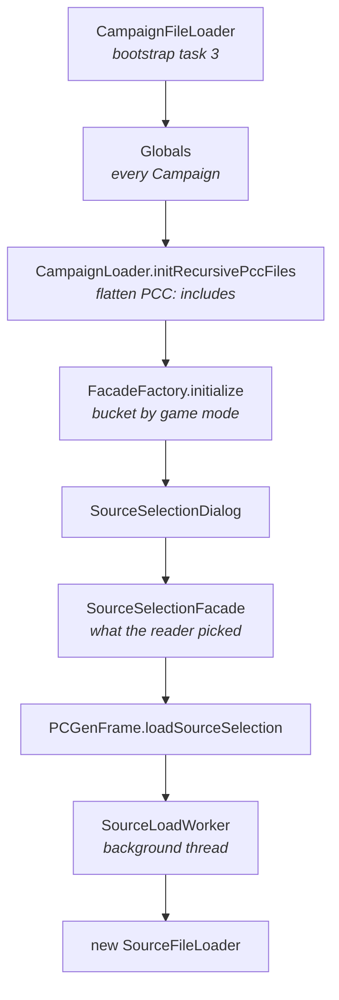

# Source selection

The code between "the program has parsed every `.pcc` on disk" and "the load pipeline
starts". For the data author's view of the same ground, see
[sources](../lst/concepts/sources.md).

All paths are relative to the PCGen repository root, at commit
[`d262f8b4`](https://github.com/PCGen/pcgen/tree/d262f8b44952860ff857132035fb32d8d11361fa).

## Overview

Steps 1 to 3 happen at startup. Everything from step 5 happens when the reader presses
load.

## Discovery

`CampaignFileLoader` runs as the third [bootstrap task](startup.md). It walks three
roots in a fixed order: the data path, the vendor path, then the
homebrew path. The finder is recursive and has no depth limit.

*Source: [`CampaignFileLoader.java`](https://github.com/PCGen/pcgen/blob/d262f8b44952860ff857132035fb32d8d11361fa/code/src/java/pcgen/persistence/CampaignFileLoader.java)*

In batch mode an alternate folder replaces all three.

Each file becomes a `Campaign` and is registered in `Globals` the first time its URI is
seen. Nothing validates it. A `.pcc` with no tags registers as an empty campaign.

## Flattening includes

Still at startup, `initRecursivePccFiles` walks each campaign's `PCC:` list. For every
include it loads the sub-campaign if it is not loaded already. It recurses into that
one, then **appends its file lists onto the end of the parent's**.

*Source: [`CampaignLoader.java`](https://github.com/PCGen/pcgen/blob/d262f8b44952860ff857132035fb32d8d11361fa/code/src/java/pcgen/persistence/lst/CampaignLoader.java)*

Two consequences worth knowing:

- Includes are resolved bottom-up, so a deeply nested include's files land last.
- A failed include is caught and logged, and the parent loads without it.

The sub-campaign also stays registered on its own, so it remains independently
selectable.

## Building the list

`FacadeFactory.initialize` wraps `Globals.getCampaignList()` and buckets every campaign
by game mode. No sorting happens here — the order is discovery order.

*Source: [`FacadeFactory.java`](https://github.com/PCGen/pcgen/blob/d262f8b44952860ff857132035fb32d8d11361fa/code/src/java/pcgen/system/FacadeFactory.java)*

Quick picks are assembled in the same class, from three places:

| Source of a quick pick | Comes from |
|---|---|
| one campaign | `SHOW_IN_MENU` true **and** a non-empty game mode list |
| a game mode's default set | `GameMode.getDefaultDataSetList()` |
| a saved selection | a `customSources` child context in the reader's settings |

The advanced panel builds its tree from `StringKey.DATA_PRODUCER`,
`StringKey.DATA_FORMAT` and `StringKey.CAMPAIGN_SETTING` — the three levels of the PCC
`TYPE` tag. `ListKey.BOOK_TYPE` and status are table columns, not tree levels.

## From the button to the loader

1. The dialog builds a `SourceSelectionFacade` and checks prerequisites through
   `FacadeFactory.passesPrereqs`.
2. `PCGenFrame.loadSourceSelection` starts a `SourceLoadWorker` on a background thread.
3. That worker constructs `SourceFileLoader` with the campaigns and the game mode name.

*Source: [`PCGenFrame.java`](https://github.com/PCGen/pcgen/blob/d262f8b44952860ff857132035fb32d8d11361fa/code/src/java/pcgen/gui2/PCGenFrame.java)*

The selection is remembered in two independent places. `LAST_LOADED_GAME` and
`LAST_LOADED_SOURCES` in `PCGenSettings` drive the auto-load at next start. A
per-game-mode key in `UIPropertyContext` drives what the advanced panel shows.

The [load pipeline](load-pipeline.md) takes over from here.

## Ordering, inside SourceFileLoader

`loadCampaigns` decides the order everything is read in, and it is worth reading if you
ever need to explain why a `.MOD` did not apply.

| Step | Method | Effect |
|---|---|---|
| 1 | `sortCampaignsByRank` | selected campaigns, `CAMPAIGN_RANK` **descending** |
| 2 | `readPccFiles` | each campaign appends its entries per `ListKey` |
| 3 | the body of `loadCampaigns` | one `loadLstFiles` call per type, in a fixed sequence |

*Source: [`SourceFileLoader.java`](https://github.com/PCGen/pcgen/blob/d262f8b44952860ff857132035fb32d8d11361fa/code/src/java/pcgen/persistence/SourceFileLoader.java)*

Step 3 is a literal sequence of calls in one method. Data cannot reorder it, and a new
file type means editing that method.

Two more passes run inside `readPccFiles`:

- `stripLstExcludes` removes every file named by any selected campaign's `LSTEXCLUDE`,
  from every file list. It is global, not per campaign.
- `setCampaignOptions` applies `OPTION:` values into `PCGenSettings`, the same store the
  preferences dialog writes to. Gated by one preference, on by default.

## Licences, after the fact

`SourceFileLoader` accumulates three flags while reading PCC files. They record whether
any selected campaign is Open Game Licence, licensed, or mature. The `COPYRIGHT` lines
and licence text are collected alongside them.

`PCGenFrame.showLicenses` reads those once loading finishes and puts up the dialogs. The
name suggests they gate the load; they do not. The data is already in memory.

## Errors

`SourceFileLoader` installs a log handler at the warning level for the duration of the
load. Whatever it collects is handed to `PCGenStatusBar.setSourceLoadErrors`, which sets
the status icon to stop, alert or ok.

*Source: [`PCGenStatusBar.java`](https://github.com/PCGen/pcgen/blob/d262f8b44952860ff857132035fb32d8d11361fa/code/src/java/pcgen/gui2/PCGenStatusBar.java)*

A missing `.lst` file is caught in `LstFileLoader.readFromURI`, logged, and skipped. The
in-source comment says why plainly: one file not found must not stop every other file
from loading.

*Source: [`LstFileLoader.java`](https://github.com/PCGen/pcgen/blob/d262f8b44952860ff857132035fb32d8d11361fa/code/src/java/pcgen/persistence/lst/LstFileLoader.java)*

## Duplicate objects

`LstObjectFileLoader.storeObject` handles two objects of one type sharing a key. With the
override preference on, which is the default, it compares `ObjectKey.SOURCE_DATE`:

- The new object is newer: the existing one is forgotten.
- Otherwise: the new one is forgotten.

With the preference off, neither is dropped and an error names both files.

A second, later check in `AbstractReferenceManufacturer.validateDuplicates` reports
same-key objects that survived and are not equal.

*Source: [`LstObjectFileLoader.java`](https://github.com/PCGen/pcgen/blob/d262f8b44952860ff857132035fb32d8d11361fa/code/src/java/pcgen/persistence/lst/LstObjectFileLoader.java)*

## Reloading

`PCGenActionMap.ReloadSourcesAction`, on **Sources → Reload** and Ctrl+Shift+R, calls
`unloadSources` and then `loadSourceSelection` with the same selection. `unloadSources`
clears the current data set and calls `Globals.emptyLists()`.

*Source: [`PCGenActionMap.java`](https://github.com/PCGen/pcgen/blob/d262f8b44952860ff857132035fb32d8d11361fa/code/src/java/pcgen/gui2/PCGenActionMap.java)*

The whole load runs again in the same process, which makes it the fastest way to test a
data edit.

## Migration

`SourceMigration` runs when a **saved character** is opened, not when data loads. It maps a campaign key recorded in a `.pcg` file to its current name. It is one of six
migrators in `pcgen/io/migration/`, alongside ability, equipment, equipment set, race
and spell. The rules come
from the game mode's `migration.lst`, filtered by the PCGen version that wrote the file.

*Source: [`SourceMigration.java`](https://github.com/PCGen/pcgen/blob/d262f8b44952860ff857132035fb32d8d11361fa/code/src/java/pcgen/io/migration/SourceMigration.java)*

With no matching rule the campaign is dropped from the character's list without an error
at that point.

## Related

- [Sources](../lst/concepts/sources.md) — the same ground for data authors
- [Startup sequence](startup.md) — where discovery sits
- [Load pipeline](load-pipeline.md) — what happens after this
- [The interface layer](ui-layer.md) — the dialog itself
