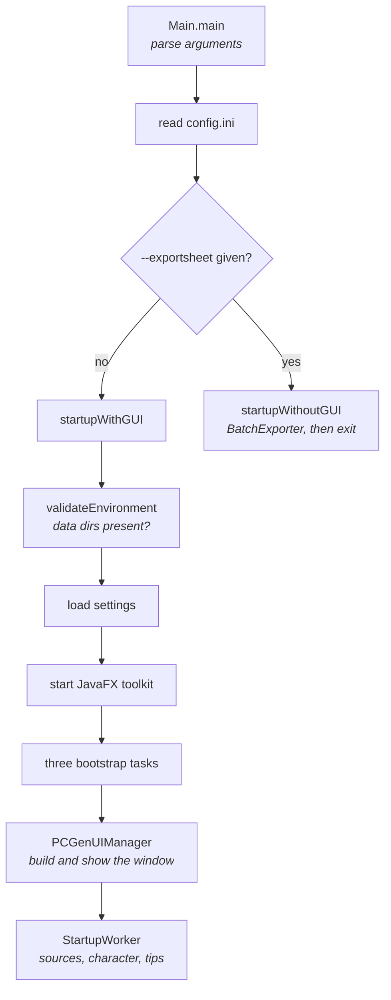

# Startup sequence

What happens between launching PCGen and the main window appearing. The data loading
that follows has [its own page](load-pipeline.md) — this one stops where that begins.

All paths are relative to the PCGen repository root, at commit
[`d262f8b4`](https://github.com/PCGen/pcgen/tree/d262f8b44952860ff857132035fb32d8d11361fa).

## Overview



## The entry point

`pcgen.system.Main` is the class named in the build, and everything starts in its
`main`. Before anything else it installs an uncaught exception handler and starts a
deadlock detector that watches for the event thread wedging against the logger.

*Source: [`Main.java`](https://github.com/PCGen/pcgen/blob/d262f8b44952860ff857132035fb32d8d11361fa/code/src/java/pcgen/system/Main.java)*

## Command line arguments

Every option PCGen accepts is declared in one parser.

| Option | Does |
|---|---|
| `-v`, `--verbose` | raise the log level to `FINER` |
| `-V`, `--version` | print the version and exit |
| `-s`, `--settingsdir` | use a settings directory other than the default |
| `-S`, `--configfilename` | use a named config file instead of `config.ini` |
| `-m`, `--campaignmode` | load a named source selection at startup |
| `-D`, `--tab` | open on a named tab |
| `-E`, `--exportsheet` | export a character with no window, then exit |
| `-c`, `--character` | the character file to export |
| `-p`, `--party` | the party file to export |
| `-o`, `--outputfile` | where the export goes |
| `--name-generator` | open the random name dialog and nothing else |

*Source: [`CommandLineArguments.java`](https://github.com/PCGen/pcgen/blob/d262f8b44952860ff857132035fb32d8d11361fa/code/src/java/pcgen/system/CommandLineArguments.java)*

There is no option to check a data set. `--exportsheet` needs a character, so it cannot
stand in for one. Use `datatest` instead, described in [testing](testing.md).

## Finding config.ini

`config.ini` says where everything else lives. PCGen looks for it in this order:

1. The system property `pcgen.config`, when it names a directory that exists.
2. The `-s` argument.
3. The working directory.

A missing file is not an error. The defaults apply, and the file is written at exit.

## Finding the install root

The defaults in `config.ini` are written as `@data`, `@system` and so on. The `@` means
"relative to the install root", and the install root is discovered rather than
configured.

`ConfigurationSettings` checks six directories: `java.home` itself and five above it. It checks
each level, and each `app` subdirectory, for one that holds both `data/` and `system/`.
If none matches, it falls back to the working directory.

*Source: [`ConfigurationSettings.java`](https://github.com/PCGen/pcgen/blob/d262f8b44952860ff857132035fb32d8d11361fa/code/src/java/pcgen/system/ConfigurationSettings.java)*

That search is why running from a checkout needs no configuration, and why a jar copied
somewhere else does not start.

The keys that matter:

| Key | Points at |
|---|---|
| `settingsPath` | your settings and saved options |
| `pccFilesPath` | the data root scanned for `.pcc` files |
| `systemsPath` | `system/`, holding the game modes |
| `pluginsPath` | the plugin jars |
| `homebrewdataPath`, `vendordataPath` | the other two data roots |

## Where your settings live

The settings directory is per user and per operating system.

| System | Path |
|---|---|
| Windows | `~/.pcgen` |
| macOS | `~/Library/Preferences/pcgen` |
| Linux and other Unix | `$XDG_CONFIG_HOME/pcgen`, or `~/.config/pcgen` |

Options are written to `options.ini` in that directory, through `PCGenSettings`. On a
first run with no `-s` argument, PCGen asks where to put it.

### One file, namespaced by the context that reads it

Everything lands in that single `options.ini`. There is no file per subsystem, because
every `PropertyContext` shares the root's `Properties` object.

Nesting happens in the key instead. `createChildContext("gameMode")` returns a context
that prefixes `gameMode.` onto every key, and each hop up to the root adds its own name:

```java
public String getProperty(String key)
{
    if (parent != null)
    {
        return parent.getProperty(name + '.' + key);
    }
    return properties.getProperty(key);
}
```

`GameMode` uses this to make a preference per game mode without the caller doing
anything. So does every filter button and chooser dialog, keyed by its own preference
name.

**A read from the wrong context is silent.** `getProperty(key, defaultValue)` returns the
default when the key is absent, which is exactly what a mis-namespaced read produces. The
setting looks unset, the default is used, and nothing is logged.

Four classes extend `PropertyContext`: `PCGenSettings`, `ConfigurationSettings`,
`LegacySettings` and `UIPropertyContext`. Between them the code calls the `initProperty`
family 47 times, and names `PCGenSettings` 222 times against `ConfigurationSettings`'
115.

*Source: [`PropertyContext.java`](https://github.com/PCGen/pcgen/blob/d262f8b44952860ff857132035fb32d8d11361fa/code/src/java/pcgen/system/PropertyContext.java)*

## The three bootstrap tasks

`PCGenTaskExecutor` runs a queue of `PCGenTask` objects in order, weighting each one so
the splash bar advances sensibly. There are three, and the order matters:

| Order | Task | Does |
|---|---|---|
| 1 | plugin load | scans `plugins/` and registers every token class |
| 2 | `GameModeFileLoader` | reads `system/gameModes/` |
| 3 | `CampaignFileLoader` | finds every `.pcc` under the data roots |

Plugins come first because nothing can be parsed before the tokens exist. Game modes
come next because a campaign declares which mode it belongs to. Campaign discovery
comes last.

*Source: [`PCGenTaskExecutor.java`](https://github.com/PCGen/pcgen/blob/d262f8b44952860ff857132035fb32d8d11361fa/code/src/java/pcgen/system/PCGenTaskExecutor.java)*

Task 1 is the mechanism described in [plugin loading](plugin-loading.md). Task 3 is
step 1 of the [load pipeline](load-pipeline.md).

### What counts as a game mode

`GameModeFileLoader` lists the subdirectories of `system/gameModes/` and keeps the ones
holding **both** `statsandchecks.lst` and `miscinfo.lst`. Each surviving directory is
read by a series of loaders and becomes one `GameMode` object.

*Source: [`GameModeFileLoader.java`](https://github.com/PCGen/pcgen/blob/d262f8b44952860ff857132035fb32d8d11361fa/code/src/java/pcgen/persistence/GameModeFileLoader.java)*

A game mode directory missing either file is skipped with no message. That is the first
thing to check when a new mode does not appear.

## Before the tasks run

Three things happen before the bootstrap queue starts:

1. **`configureUI`** sets the locale and initialises `LanguageBundle`.
2. **`validateEnvironment`** checks that `system/`, `data/`, `plugins/`, `preview/` and
   `outputsheets/` all exist. A missing directory is fatal, with a dialog.
3. **`new JFXPanel()`** starts the JavaFX toolkit, even though the main window is
   Swing. See [the interface layer](ui-layer.md).

## The window appears

After the tasks finish, `Main` calls `FacadeFactory.initialize()`, then hands over to
`PCGenUIManager`, which builds `PCGenFrame` and shows it.

The window is visible **before** any game data is loaded. A background worker then does
the rest:

- `-m` given: load that source selection.
- `-c` given: load that character.
- Otherwise: show the tip of the day, then the source selection dialog.

*Source: [`PCGenFrame.java`](https://github.com/PCGen/pcgen/blob/d262f8b44952860ff857132035fb32d8d11361fa/code/src/java/pcgen/gui2/PCGenFrame.java)*

Choosing sources in that dialog is what constructs a `SourceFileLoader`. Everything in
the [load pipeline](load-pipeline.md) happens after the window is already up. That is
why load errors arrive in a dialog rather than on the console.

## Logging

`pcgen.util.Logging` wraps `java.util.logging`. Its static initialiser looks for
`logging.properties` in the working directory first, then up the tree from `java.home`,
and reads whatever it finds.

*Source: [`Logging.java`](https://github.com/PCGen/pcgen/blob/d262f8b44952860ff857132035fb32d8d11361fa/code/src/java/pcgen/util/Logging.java)*

To see more, pass `-v`. That sets the level to `FINER` for the whole run.

A message only reaches the user if a handler is listening at that level, and only three
places register one. See
[reading errors instead of stepping](running-and-debugging.md#reading-errors-instead-of-stepping).

## Headless export

With `-E`, `Main` takes a different branch. It loads settings, validates the
environment and runs the same three bootstrap tasks. Then it builds a
`ConsoleUIDelegate` and a `BatchExporter` rather than a window.

Same startup, no interface. This is the only supported way to run PCGen with no
display.

## Shutdown

`Main.shutdown` runs four cleanup steps: save the config contexts, delete the
temporary export files, save the settings contexts, and write `customEquipment.lst`
when needed. Each is wrapped so a failure in one cannot stop the others.

Exit itself goes through `GracefulExit`, which runs registered interceptors first. Any
interceptor may veto, which is how an unsaved character prompts before closing.

*Source: [`GracefulExit.java`](https://github.com/PCGen/pcgen/blob/d262f8b44952860ff857132035fb32d8d11361fa/code/src/java/pcgen/util/GracefulExit.java)*

`System.exit` is banned across the code base for this reason. A Checkstyle rule
enforces it. See [contributing](contributing.md).

## Related

- [Building from source](building.md) — getting to the point where this runs
- [Load pipeline](load-pipeline.md) — what happens after sources are chosen
- [Plugin loading](plugin-loading.md) — bootstrap task 1, in detail
- [The interface layer](ui-layer.md) — what `PCGenUIManager` builds
