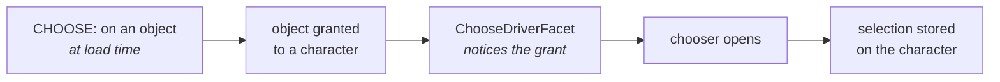

# Choosers

A chooser is a `CHOOSE:` tag and the selection it drives. It is how one line of data
becomes "Skill Focus (any skill)" rather than a separate feat for every skill.

There are **30** chooser types. Shipped data uses `CHOOSE:` about 11,200 times, and
half of those are one form that presents no choice at all. Read on for why.

## What a CHOOSE tag does

Nothing, on its own.

`CHOOSE:` stores a description of a choice on the object. The choice is made when the
object is **granted to a character**. That means a race being set, a class level taken,
a feat picked, or an `ADD:` tag handing the object over.



`ChooseDriverFacet` listens for objects arriving on a character. When one arrives that
implements `ChooseDriver` and carries a `CHOOSE:`, it runs the chooser.

*Source: [`ChooseDriverFacet.java`](https://github.com/PCGen/pcgen/blob/d262f8b44952860ff857132035fb32d8d11361fa/code/src/java/pcgen/cdom/facet/ChooseDriverFacet.java)*

So a `CHOOSE:` on an object nobody ever grants is dead text. It parses, it loads, and
it never runs. That is the most common mistake with this tag.

## Where it is legal

Only types implementing `ChooseDriver` drive a choice:

| Type | Implements it |
|---|---|
| `Race` | yes |
| `Skill` | yes |
| `PCTemplate` | yes |
| `Domain` | yes |
| `Ability` | **no** — the granted instance does |

Abilities are the interesting case. The raw `Ability` object is not the driver.
`CNAbility` is — the runtime pairing of category, ability and how it was granted. That
is why the same feat taken twice can hold two different selections.

## One CHOOSE per object

`CHOOSE:` writes a single key. A second one on the same line does not add a second
choice, and mixing an old-style and a new-style chooser is a load error:

```text
New style CHOOSE and old style CHOOSE both found
```

*Source: [`ChooseLst.java`](https://github.com/PCGen/pcgen/blob/d262f8b44952860ff857132035fb32d8d11361fa/code/src/java/plugin/lsttokens/ChooseLst.java)*

## The shape

```
CHOOSE:<type>|<what to choose from>|TITLE=<prompt>
```

Two real examples, with their exact grammar taken from the token classes:

```
CHOOSE:SKILL|TYPE=Knowledge|TITLE=Choose a Knowledge skill
CHOOSE:USERINPUT|TITLE=Name your patron
```

`CHOOSE:SKILL` takes a list of things to choose from, comma or pipe separated, then an
optional title. `CHOOSE:USERINPUT` takes no list at all — it asks the reader to type
something.

*Source: [`choose/SkillToken.java`](https://github.com/PCGen/pcgen/blob/d262f8b44952860ff857132035fb32d8d11361fa/code/src/java/plugin/lsttokens/choose/SkillToken.java)*

## Narrowing the list

The middle part is not a plain list of names. Four forms compose:

| Written | Means |
|---|---|
| `Sample Skill` | that one object |
| `TYPE=Knowledge` | every object of that type |
| `!TYPE=Knowledge` | everything except that type |
| `ALL` | everything of the chooser's type |
| `Sample%` | name pattern match |

*Source: [`ChoiceSetLoadUtilities.java`](https://github.com/PCGen/pcgen/blob/d262f8b44952860ff857132035fb32d8d11361fa/code/src/java/pcgen/rules/persistence/ChoiceSetLoadUtilities.java)*

Beyond those, two plugin families extend what can appear there:

| Package | Adds |
|---|---|
| `plugin/primitive/` | ways to name a group, such as a spell school or a race type |
| `plugin/qualifier/` | filters on the character, such as skills with no ranks |

Both accept a leading `!` to invert them.

## How many choices

Three tags control counting, and they are not the same thing.

| Tag | Controls |
|---|---|
| `SELECT:` | how many picks the chooser prompts for at once |
| `CHOOSE:NUMCHOICES=` | how many distinct selections are legal in total |
| `MULT:` | whether the object may be taken more than once |
| `STACK:` | whether taking it twice with the *same* selection doubles up |

`NUMCHOICES=` is not a chooser type. It is a prefix on the value, stripped before the
real type is read:

```
CHOOSE:NUMCHOICES=2|SKILL|TYPE=Knowledge
```

`MULT:YES` requires a `CHOOSE:`, and `MULT:NO` forbids one. Both are checked at load
and reported as errors.

*Source: [`ability/MultToken.java`](https://github.com/PCGen/pcgen/blob/d262f8b44952860ff857132035fb32d8d11361fa/code/src/java/plugin/lsttokens/ability/MultToken.java)*

See [ability files](../files/ability.md) for `MULT` and `STACK` in context.

## CHOOSE:NOCHOICE

The most used chooser by a wide margin — 5,421 of about 11,200 uses. It presents
nothing. Its list of options is a single empty string.

It exists because `MULT:YES` demands a chooser. An ability that can be taken repeatedly
with no sub-choice still needs one, so data writes the chooser that chooses nothing:

```
Sample Toughness	CATEGORY:FEAT	TYPE:General	MULT:YES	STACK:YES	CHOOSE:NOCHOICE	BONUS:HP|CURRENTMAX|3
```

`CHOOSE:NOCHOICE` requires both `MULT:YES` and `STACK:YES`. Without them the line fails
to load.

*Source: [`choose/NoChoiceToken.java`](https://github.com/PCGen/pcgen/blob/d262f8b44952860ff857132035fb32d8d11361fa/code/src/java/plugin/lsttokens/choose/NoChoiceToken.java)*

Read it as "this can be taken again", not as "this asks a question".

## The ones you will actually meet

Ranked by use in shipped data:

| Chooser | Uses | Picks |
|---|---|---|
| `NOCHOICE` | 5,421 | nothing, see above |
| `SPELLS` | 590 | a spell |
| `SKILL` | 580 | a skill |
| `USERINPUT` | 521 | free text typed by the reader |
| `STRING` | 476 | one of a fixed list you write |
| `WEAPONPROFICIENCY` | 407 | a weapon proficiency |
| `ABILITYSELECTION` | 201 | an ability together with its own choice |
| `ABILITY` | 192 | an ability |
| `CLASS` | 191 | a class |

`STRING` and `USERINPUT` are the two that need no game object at all. `STRING` offers a
list you supply; `USERINPUT` accepts anything typed.

### ABILITY versus ABILITYSELECTION

`CHOOSE:ABILITY` picks an ability. `CHOOSE:ABILITYSELECTION` picks an ability **and**
resolves that ability's own chooser at the same time.

Use the second when granting something like "any Weapon Focus, including its weapon".

## Where the answer goes

The selection is stored on the character in an association list, keyed per chooser type.
Saving a character writes the selection into the `.pcg` file, and loading it restores
the choice without asking again.

## Gotchas

**A chooser on an ungranted object never runs.** Nothing warns you. Check that
something actually grants the object.

**`CHOOSE:FEAT` is deprecated.** Use `CHOOSE:ABILITY` or `CHOOSE:ABILITYSELECTION`. The
old class still loads and logs a notice.

**`CHOOSE:USERINPUT|2|TITLE=...` is deprecated.** The count form now belongs in
`SELECT:`. The parser accepts it and prints a deprecation message.

**`MULT:YES` without a chooser is a load error, not a warning.** If you want repeats
with no question asked, that is what `CHOOSE:NOCHOICE` is for.

**A title is worth writing.** Without `TITLE=`, the reader sees a generic prompt.

## Related

- [Ability files](../files/ability.md) — `MULT`, `STACK` and where choosers are used most
- [Prerequisites](prerequisites.md) — the other way to gate what a character may take
- [Tag index](../reference/tag-index.md) — all 30 chooser types
- [The token system](../../internals/token-system.md) — how sub-tokens are dispatched
