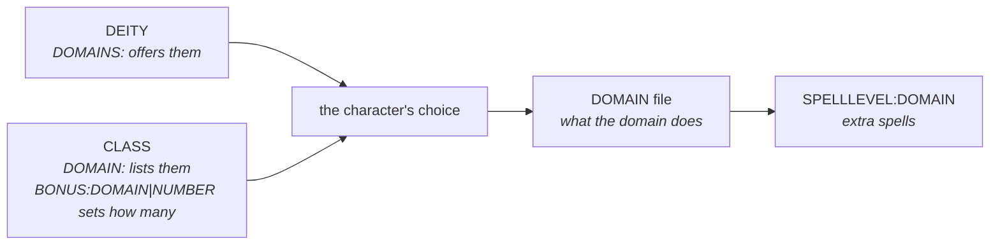

# Domain files

A domain is a themed package a divine caster picks: a granted ability, a few extra
spells, sometimes a class skill. Loaded by `DOMAIN:` in a [PCC](pcc.md).

Domains are a small file type — 904 lines across 85 files in shipped data — but they sit
at the junction of three others. Most of the work of understanding them is understanding
that junction.

## Minimum working line

```
Sample Domain	DESC:An example domain.
```

Only the name is required. A domain with nothing else loads and does nothing.

## Only two tags of its own

| Tag | Does |
|---|---|
| `CSKILL` | makes a skill a class skill |
| `CCSKILL` | makes a skill a cross-class skill |

*Source: [`plugin/lsttokens/domain/`](https://github.com/PCGen/pcgen/tree/d262f8b44952860ff857132035fb32d8d11361fa/code/src/java/plugin/lsttokens/domain)*

Everything else on a domain line is a global tag. That is why the tag list below is
short and the page is mostly about linkage.

`CSKILL` on a domain is narrower than it looks. The skill becomes a class skill **for
the class that granted this domain**, not for the character generally.

## The three-way link



Four tags in three files, and all four have to agree:

| Written on | Tag | Says |
|---|---|---|
| a deity | `DOMAINS:` | which domains followers may take |
| a class | `DOMAIN:` | which domains this class allows |
| a class | `BONUS:DOMAIN|NUMBER|1` | how many the character picks |
| the domain | its own tags | what taking it does |

Miss the third and the character qualifies for domains but may choose none. That is the
most common failure, because nothing reports it. The list is empty and looks correct.

The character's choice records which class granted it. If the deity changes and the
domain is no longer offered, the choice is removed on the next load.

## SPELLLEVEL:DOMAIN

864 uses in 904 lines, so nearly every domain line carries one. It adds spells to the
domain's spell list:

```
Sample Domain	SPELLLEVEL:DOMAIN|Sample Domain=1|Sample Flame|Sample Domain=2|Sample Ward
```

Read it as repeating pairs: a list name with a level, then the spells at that level.

*Source: [`SpelllevelLst.java`](https://github.com/PCGen/pcgen/blob/d262f8b44952860ff857132035fb32d8d11361fa/code/src/java/plugin/lsttokens/SpelllevelLst.java)*

The same tag with `CLASS` instead of `DOMAIN` does the same job for a class list.

### Two directions to the same link

A spell can join a domain list from either end:

| Written on | Tag | Direction |
|---|---|---|
| the domain | `SPELLLEVEL:DOMAIN` | the domain claims spells |
| the spell | `DOMAINS:` | the spell joins domains |

Both edit the same list. Use the domain end when adding a themed set at once, and the
spell end when one new spell belongs to an existing domain. Mixing them is legal and
common — shipped data does both, sometimes for the same domain.

See [spell files](spell.md) for the tag on the other side.

## Granting an ability

509 of 904 domain lines grant something:

```
Sample Domain	ABILITY:FEAT|AUTOMATIC|Sample Feat
```

The category is almost always `FEAT` and the nature almost always `AUTOMATIC`, meaning
the character receives it on taking the domain rather than choosing it.

## A complete example

```
# my_domains.lst - example domains
# Invented content. Nothing from a published book.

Sample Domain	DESC:Grants warmth and a little fire.	ABILITY:FEAT|AUTOMATIC|Sample Feat	CSKILL:Sample Skill	SPELLLEVEL:DOMAIN|Sample Domain=1|Sample Flame|Sample Domain=2|Sample Ward	SOURCEPAGE:p.1
Sample Order Domain	DESC:Grants steadiness.	BONUS:SAVE|ALL|1	SPELLLEVEL:DOMAIN|Sample Order Domain=1|Sample Ward
```

Then in the PCC:

```
DOMAIN:my_domains.lst
```

And on the deity that offers them:

```
Sample Deity	ALIGN:LG	DOMAINS:Sample Domain|Sample Order Domain
```

## Gotchas

**A deity may not mix `ALL` with a named domain.** That combination is rejected at load.

**A domain named by a deity but never defined fails late.** The reference resolves after
loading, so the error names the deity's file, not the missing domain.

**Domain keys are global.** Two sources defining the same domain key collide, and the
one with the newer `SOURCEDATE` wins. See
[keys and names](../concepts/keys-and-names.md).

**`CSKILL` is scoped to the granting class.** A character with two spellcasting classes
gets the class skill only through the one that granted the domain.

**Without `BONUS:DOMAIN|NUMBER` on a class, nothing is chosen.** The domains are legal
and the character picks none.

**A spell listed at level `-1` is removed from the list, not added at a low level.**

## Related

- [Deity files](deity.md) — the `DOMAINS:` tag that offers them
- [Spell files](spell.md) — the other end of the spell list link
- [Class files](class.md) — where domain slots come from
- [Tag index](../reference/tag-index.md) — every `Domain` tag
