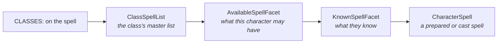

# Spell files

A spell file defines spells. Loaded by `SPELL:` in a [PCC](pcc.md).

Spells are among the larger file types — 37,360 lines across 360 files, behind abilities, kits and equipment. They
also work differently from everything else here: a spell is never granted to a
character. It joins a **spell list**, and the character reaches it through a class or a
domain.

Spells have **18** tags of their own.

## Minimum working line

```
Sample Spell	CLASSES:Sample Caster=1	SCHOOL:Sample School
```

Only the name is required by the loader. Without `CLASSES:` or `DOMAINS:`, though, no
caster can ever reach the spell.

## Spells are never granted

`Spell` is marked `Ungranted`. That is a real restriction, not a label:

- A spell cannot grant anything else.
- `BONUS:` on a spell line is refused.

*Source: [`Spell.java`](https://github.com/PCGen/pcgen/blob/d262f8b44952860ff857132035fb32d8d11361fa/code/src/java/pcgen/core/spell/Spell.java)*

Effects belong on the abilities and items that cast the spell, not on the spell itself.

## CLASSES puts the spell on a list

The most used spell tag, at 25,738 uses, and the one that matters most.

```
CLASSES:Sample Caster=3
CLASSES:Sample Caster,Sample Adept=3|Sample Priest=4
```

| Written | Means |
|---|---|
| `Name=3` | that class's list, at level 3 |
| `Name,Other=3` | both lists, both at level 3 |
| `A=3\|B=4` | different levels for different lists |
| `TYPE=Sample=2` | every class list of that type, at level 2 |
| `ALL=2` | every class list |
| `Name=-1` | **remove** the spell from that list |

A trailing `[PREREQ...]` applies to the whole tag.

*Source: [`spell/ClassesToken.java`](https://github.com/PCGen/pcgen/blob/d262f8b44952860ff857132035fb32d8d11361fa/code/src/java/plugin/lsttokens/spell/ClassesToken.java)*

`ALL` cannot be mixed with a named class in the same tag. The parser rejects it rather
than combining them.

`DOMAINS:` works the same way and targets domain lists instead:

```
DOMAINS:Sample Domain=2
```

See [domain files](domain.md) for the other direction, where a domain claims spells
rather than a spell claiming a domain.

## Descriptive tags

Most of these are display text. Only one is checked against anything.

| Tag | Value | Checked? |
|---|---|---|
| `SCHOOL` | school name | **yes** — the school is created if it does not exist |
| `SUBSCHOOL` | text | no |
| `DESCRIPTOR` | text | no |
| `COMPS` | text | no |
| `CASTTIME` | text | no |
| `RANGE` | text | parentheses must balance |
| `TARGETAREA` | one string | parentheses must balance |
| `DURATION` | text | parentheses must balance |
| `SAVEINFO` | text | no |
| `SPELLRES` | text | no |

`SAVEINFO` in particular is not parsed. It is a string printed on the sheet, so PCGen
does not know what the save actually does.

`SCHOOL` rejects the literal values `ALL` and `ANY`.

## DESC with substitutions

`DESC:` takes the text first, then values after each pipe. In the text, `%1` is the
first value, `%2` the second:

```
DESC:Deals %1 damage to one target.|1d6
```

*Source: [`Description.java`](https://github.com/PCGen/pcgen/blob/d262f8b44952860ff857132035fb32d8d11361fa/code/src/java/pcgen/core/Description.java)*

Placeholders start at `%1`, not `%0`. `%%` is a literal percent sign.

An index with no matching value is skipped in silence, so a missing pipe field produces
a quietly truncated sentence rather than an error.

## ITEM

Controls which magic items the spell may be built into. 3,738 uses.

```
ITEM:Scroll,Wand
ITEM:[Potion]
```

A plain type is allowed. A type in brackets is prohibited. Potions are prohibited by
default unless the tag says otherwise, which is the one asymmetry to remember.

## A complete example

```
# my_spells.lst - example spells
# Invented content. Nothing from a published book.

Sample Flame	CLASSES:Sample Caster=1	SCHOOL:Sample School	COMPS:V, S	CASTTIME:1 action	RANGE:Close	TARGETAREA:One creature	DURATION:Instantaneous	SAVEINFO:Reflex half	SPELLRES:Yes	DESC:Deals %1 fire damage to one creature.|1d6	ITEM:Scroll,Wand	SOURCEPAGE:p.1
Sample Ward	CLASSES:Sample Caster=2|Sample Priest=1	DOMAINS:Sample Domain=1	SCHOOL:Sample School	COMPS:V, S, M	CASTTIME:1 action	RANGE:Touch	TARGETAREA:One creature	DURATION:1 hour	SAVEINFO:None	SPELLRES:No	DESC:Wards one creature.
```

Then in the PCC:

```
SPELL:my_spells.lst
```

## How a spell reaches a character



The level in `CLASSES:` is stored on the link between spell and list, not on the spell.
The same spell can sit at level 3 on one list and level 4 on another. See
[the character model](../../internals/facets.md).

## Gotchas

**`=-1` removes rather than sets.** It is not "any level". A `-1` entry cannot carry a
prerequisite, and the parser rejects that combination.

**`ALL` plus a named class fails to load.** Use one or the other.

**`BONUS:` does not work on a spell.** The tag is refused because spells are
`Ungranted`. Put the effect on whatever grants the spell.

**A spell with no `CLASSES:` and no `DOMAINS:` loads and is unreachable.** Nothing warns
you, and it never appears for any caster.

**`SAVEINFO` is decoration.** PCGen prints it and does nothing with it. The save is not
calculated from this tag.

**`%1` with no matching value produces no error.** Check the sheet, not the log.

## Related

- [PCC](pcc.md) — loading spell files
- [Domain files](domain.md) — the other side of the spell list link
- [Class files](class.md) — where spell lists come from
- [Tag index](../reference/tag-index.md) — every `Spell` tag
