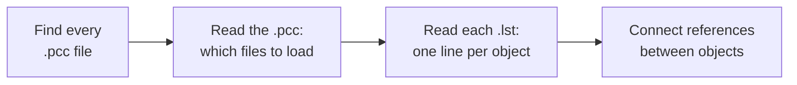

# How loading works

You wrote a line and PCGen used it. This page explains the path it took, so the next
change is reasoning rather than guessing.

This is the plain version. For the class-by-class trace, see the
[load pipeline](../internals/load-pipeline.md).

## Four steps



### 1. Find the campaigns

At startup PCGen walks the `data/` folder looking for `.pcc` files. Every one it finds
becomes an entry in the source selection list.

This is why your campaign appeared as soon as the file existed, before you had loaded
anything. Being listed only means the `.pcc` was found and parsed.

### 2. Read the campaign file

When you load a campaign, PCGen reads its `.pcc` line by line. A `.pcc` is not game
data — it is a manifest. It says what the campaign is called, which game mode it
belongs to, and **which data files to load**.

```
CAMPAIGN:Testburg
GAMEMODE:35e
ABILITY:my_abilities.lst
```

Each file-reference tag is a separate instruction, filed under the kind of data it
points at. `ABILITY:` says "this is an abilities file". `SKILL:` says "this is a skills
file".

A line starting with `#` is a comment and not an instruction. Commenting a line out is
how you narrow down a broken load.

### 3. Read the data files

For each file the `.pcc` named, PCGen reads it a line at a time.

For each line:

1. Ignore it if it starts with `#` or is blank.
2. Split it on tabs.
3. Take field 0 as the object's name, and create the object.
4. For every remaining field, split `NAME:value` and hand it to the code that
   implements that tag.

That last step is the important one. Each tag is implemented by its own small piece of
code, which validates the value and stores it on the object. `BONUS:SKILL|Sample Athletics|2` was
handed to the bonus code, which parsed the `|` arguments itself.

If no code claims the tag name, that is an error and PCGen logs it. This is why a typo
in a tag name fails loudly, while a typo in a *value* often fails quietly or does
something unintended.

### 4. Connect the references

Objects mention each other by name. A class grants a feat; a feat requires a skill.
Those names cannot be resolved while loading, because the thing being named may not be
loaded yet.

So PCGen loads everything first, then makes a second pass to connect the references. A
name that matches nothing is reported at this point.

This is why an error can name a file you did not touch. The mistake is in your file;
the *complaint* comes from whatever tried to reference it.

## What this explains

**Why order does not matter within a file.** Everything is loaded before references
are resolved, so a feat can mention a skill defined further down.

**Why you must restart PCGen.** Data is read once at load time. Editing a file while
PCGen is running changes nothing until you reload the campaign.

**Why a tag can be valid in one file and rejected in another.** Each tag declares the
kind of object it applies to. `KEYSTAT` applies to skills. Putting it on a feat is an
error, not a silently ignored line.

The [tag index](../lst/reference/tag-index.md) lists what each tag applies to.

**Why errors mention line numbers.** Loading is line by line, so PCGen always knows
where it was when something failed. Read the log before guessing.

## Next

- [Line format](../lst/concepts/line-format.md) — the file format in detail
- [Load pipeline](../internals/load-pipeline.md) — the same path, with class names
